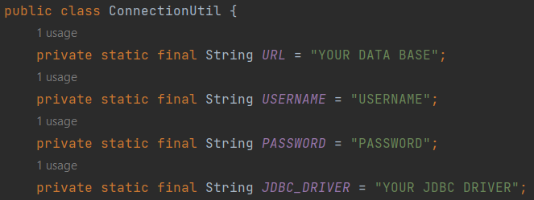
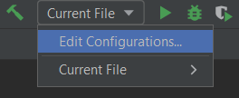
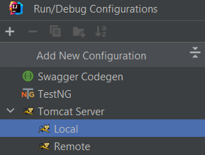
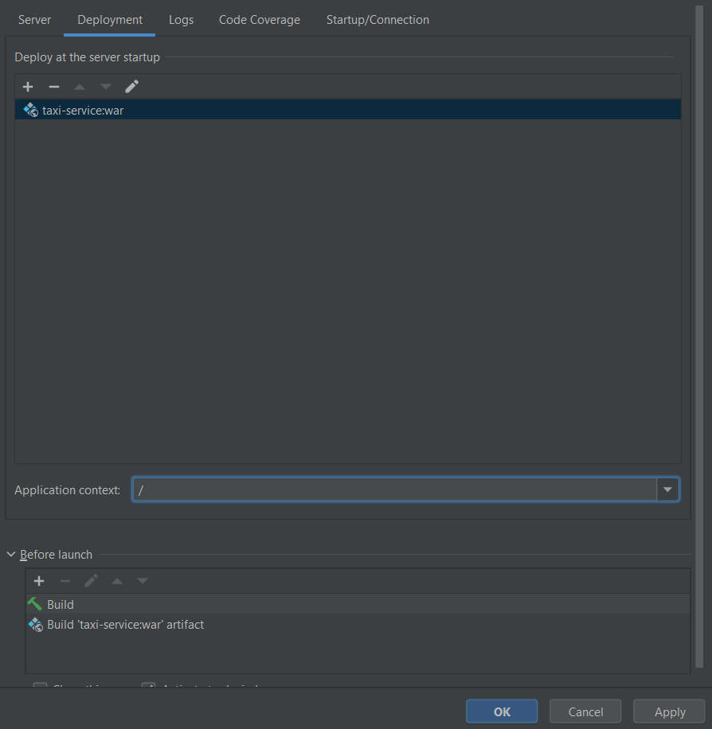

# 🚖 Taxi-service 🚖

This is a web application to demonstrate simple CRUD operations, authentication, and registration using MySQL and servlets, without any frameworks.

## Functionality

The project includes the following functionality:

- Register a driver
- Log in and log out
- Perform create, read, update, and delete operations for drivers, cars, and manufacturers
- View all drivers, cars, and manufacturers

## Project Structure

The project follows a typical structure with the following components:

- **DAO (Data Access Object):** Receives requests from the service layer, transfers them to the database, and executes SQL queries.
- **Service:** Receives requests from the controller layer, transmits them to the DAO layer, and executes business logic.
- **Controller:** Receives requests from the user, transmits them to the service layer, and returns JSP pages in response.

## Technologies Used

The project utilizes the following technologies:

- Java 20
- Apache Tomcat 9.0.76
- MySQL 8.0.33
- Maven 3.1.1
- Java Servlet 4.0.1
- JSTL 1.2
- JSP and CSS
- JDBC

## Instructions for Launching the Project

To launch the project, follow these steps:

1. Clone this project from GitHub.
2. Install Apache Tomcat version 9.x.x. You can download it from the official Apache Tomcat website: [Tomcat Downloads](https://tomcat.apache.org/download-90.cgi). Choose the appropriate installation package for your operating system.
3. Create a database using either a local MySQL installation or a remote database. Execute the schema provided in the `init_db.sql` file to set up the necessary tables and structure for the project.
4. Open the project in your preferred Integrated Development Environment (IDE). Locate the `ConnectionUtil` class in the project. It should contain the database connection settings. Fill in the appropriate values for the following fields:
    - `url`: The URL of your MySQL database. It should include the host, port, database name, and any additional connection parameters.
    - `username`: The username for accessing your MySQL database.
    - `password`: The password associated with the provided username.

   

   Note: Ensure that the database credentials you provide in `ConnectionUtil` match the ones you set up in step 3.

5. Set up the configuration for Tomcat.

   

   

   After these steps, you need to fix Tomcat. Select the artifact to deploy `taxi-service:war` and remove the Application context `taxi_service_war` to leave only `/`.

   

6. Start Tomcat, and you will be able to access your application using the provided URL.

---
